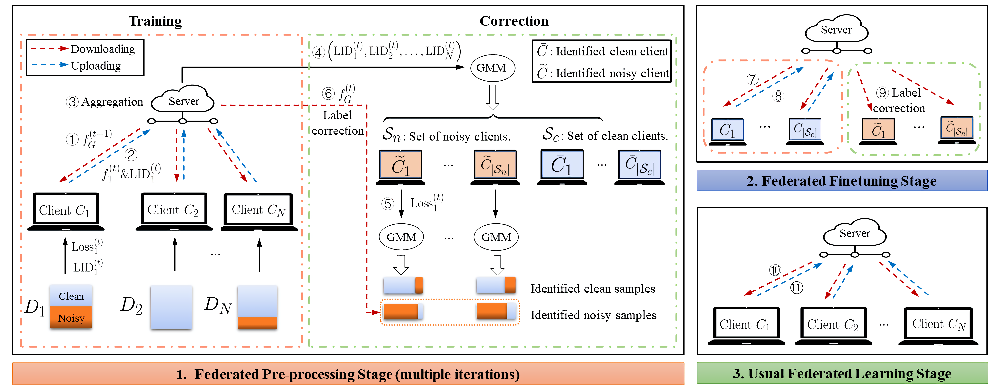
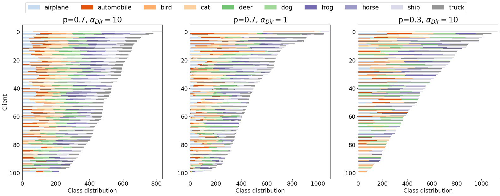
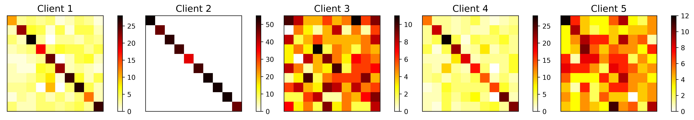

# FedCorr: Multi-Stage Federated Learning for Label Noise Correction

This is the official PyTorch code for the following CVPR 2022 paper:

**Title**: FedCorr: Multi-Stage Federated Learning for Label Noise Correction. ([Paper Link](https://arxiv.org/abs/2204.04677))

**Authors**: Jingyi Xu, Zihan Chen (equal contribution), Tony Q.S. Quek, and Kai Fong Ernest Chong

**Abstract**: Federated learning (FL) is a privacy-preserving distributed learning paradigm that enables clients to jointly train a global model. In real-world FL implementations, client data could have label noise, and different clients could have vastly different label noise levels. Although there exist methods in centralized learning for tackling label noise, such methods do not perform well on heterogeneous label noise in FL settings, due to the typically smaller sizes of client datasets and data privacy requirements in FL. In this paper, we propose FedCorr, a general multi-stage framework to tackle heterogeneous label noise in FL, without making any assumptions on the noise models of local clients, while still maintaining client data privacy. In particular, (1) FedCorr dynamically identifies noisy clients by exploiting the dimensionalities of the model prediction subspaces independently measured on all clients, and then identifies incorrect labels on noisy clients based on per-sample losses. To deal with data heterogeneity and to increase training stability, we propose an adaptive local proximal regularization term that is based on estimated local noise levels. (2) We further finetune the global model on identified clean clients and correct the noisy labels for the remaining noisy clients after finetuning. (3) Finally, we apply the usual training on all clients to make full use of all local data. Experiments conducted on CIFAR-10/100 with federated synthetic label noise, and on a real-world noisy dataset, Clothing1M, demonstrate that FedCorr is robust to label noise and substantially outperforms the state-of-the-art methods at multiple noise levels.

### Citation

```
@inproceedings{xu2022fedcorr,
    author = {Xu, Jingyi and Chen, Zihan and Quek, Tony Q.S. and Chong, Kai Fong Ernest},
    title = {FedCorr: Multi-Stage Federated Learning for Label Noise Correction},
    booktitle = {IEEE Conference on Computer Vision and Pattern Recognition (CVPR)},
    year = {2022}
}
```

​	

## Errata [Updated on November 1, 2022]

1. Supplementary material, Section 3.1, line 7 (arXiv version: page 13, line 1): Typo. The noise setting used for CIFAR-100 with non-IID data partition should be ( $\rho$, $\tau$ )=(0.4,0).


## 0. Illustration



## 1. Parameters

**1.1. Descriptions**

| parameters           | description                                                  |
| -------------------- | ------------------------------------------------------------ |
| `iteration1`         | Number of iterations in  pre-processing stage                |
| `rounds1`            | Number of rounds in finetuning stage                         |
| `rounds2`            | Number of rounds in finetuning stage                         |
| `frac1`              | Fraction for client selection in pre-processing stage        |
| `frac2`              | Fraction for client selection in other two stage             |
| `num_users`          | Number of clients                                            |
| `local_bs`           | Batch size for local training                                |
| `beta`               | Coefficient for local proximal term, default: `5`            |
| `LID_k`              | K for number of neighboring samples to estimate LID score, default: `20` |
| `level_n_system`     | Ratio of noisy clients ($\rho$ in the paper)                 |
| `level_n_lowerb`     | Lower bound of noise level ($\tau$ in the paper)             |
| `relabel_ratio`      | Ratio of relabeled samples among selected noisy samples      |
| `confidence_thres`   | Threshold of model's confidence on each sample               |
| `clean_set_thres`    | Threshold to filter 'clean' set used in finetuning stage, default: `0.1` |
| `fine_tuning`        | `Action`, whether to include fine-tuning stage, default: `store_false` |
| `correction`         | `Action`, whether to correct noisy labels, default: `store_false` |
| `model`              | neural network model                                         |
| `dataset`            | Dataset, options:`cifar10`,`cifar100` and `clothing1m`       |
| `iid`                | `Action` IID or non-IID data partition, default: `store_true` |
| `non_iid_prob_class` | Non-IID sampling probability for class ($p$ in the paper)    |
| `alpha_dirichlet`    | Parameter for Dirichlet distribution ($\alpha_{DIR}$ in the paper) |
| `pretrained`         | `Action`, whether to use pre-trained model, default: `store_true` |
| `mixup`              | `Action`, whether to use Mixup, default: `store_true`        |
| `alpha`              | Parameters for Mixup, default: `1`                           |


**1.2. Values**

| parameters         | CIFAR10  | CIFAR100 | CLOTHING1M |
| ------------------ | -------- | -------- | ---------- |
| `lr`               | 0.03     | 0.01     | 0.001      |
| `iteration1`       | 5        | 10       | 2          |
| `rounds1`          | 500      | 450      | 50         |
| `rounds2`          | 450      | 450      | 50         |
| `frac1`            | 0.01     | 0.02     | 0.002      |
| `frac2`            | 0.1      | 0.1      | 0.02       |
| `num_users`        | 100      | 50       | 500        |
| `local_bs`         | 10       | 10       | 16         |
| `relabel_ratio`    | 0.5      | 0.5      | 0.8        |
| `confidence_thres` | 0.5      | 0.5      | 0.9        |
| `model`            | resnet18 | resnet34 | resnet50   |


## 2. Heterogeneous Label Noise Model

In this paper, we propose a general framework for easy generation of heterogeneous label noise, which considers both local data statistics (i.e. IID or non-IID data partition) and local label quality (diverse noise levels for all clients).  

**2.1.  Noisy datasets (CIFAR-10/100) used in this paper**

For data partition, you can control the variability in both class distribution and the sizes of local datasets by varying `args.non_iid_prob_class` ($p$ in the paper) and `args.alpha_dirichlet` ($\alpha_{DIR}$) in util/options.py.

When adding noise, the diverse noise levels on all clients are controlled by `args.level_n_system` ($\rho$) and `args.level_n_lowerb` ($\tau$).

```python
from util.util import add_noise
from util.dataset import get_dataset

dataset_train, dataset_test, dict_users = get_dataset(args)

# ------------------- Add Noise -----------------------
y_train = np.array(dataset_train.targets)
y_train_noisy, gamma_s, real_noise_level = add_noise(args, y_train, dict_users)
dataset_train.targets = y_train_noisy
```

**2.2 Other datasets**

If you want to apply this framework to your own datasets:

```python
from util.util import add_noise
from util.sampling import iid_sampling, non_iid_dirichlet_sampling

dataset_train, dataset_test = get_your_own_dataset()
y_train = np.array(dataset_train.targets)

# ------------------- Data Partition -----------------------
if args.iid:
    dict_users = iid_sampling(n_train, args.num_users, args.seed)
else:
    dict_users = non_iid_dirichlet_sampling(y_train, args.num_classes, args.non_iid_prob_class, args.num_users, args.seed, args.alpha_dirichlet)

# ------------------- Add Noise -----------------------
y_train_noisy, gamma_s, real_noise_level = add_noise(args, y_train, dict_users)
dataset_train.targets = y_train_noisy
```


**2.3 Illustration of local data partition**

Three examples of different non-IID data partition (after sorting) on CIFAR-10 among 100 clients. Details of the figure and the its code can be found in `plot.ipynb`.	




**2.4 Illustration of noise model**

An example of noisy label distribution on the first five clients,  conducted on CIFAR-10 with IID data partition and noise setting $(\rho,\tau)=(0.6,0.5) $ among 100 clients.  For each client, we give the confusion matrix of local dataset before training.




## 3. Combating Heterogeneous Label Noise using FedCorr

+ To train on CIFAR-10 with IID data partition and noise setting $(\rho,\tau)=(0.6,0.5)$, over 100 clients:

```
python main.py --dataset cifar10 --model resnet18 --iid --level_n_system 0.6 --level_n_lowerb 0.5 --iteration1 5 --rounds1 500 --rounds2 450 --seed 1 --mixup --lr 0.03 --beta 5
```

+ To train on CIFAR-10 with non-IID data partition with $(p,\alpha_{Dir})=(0.7,10)$ and noise setting $(\rho,\tau)=(0.6,0.5)$, over 100 clients:

```
python main.py --dataset cifar10 --model resnet18 --non_iid_prob_class 0.7 --alpha_dirichlet 10 --level_n_system 0.6 --level_n_lowerb 0.5 --iteration1 5 --rounds1 500 --rounds2 450 --seed 1 --mixup --lr 0.03 --beta 5
```

+ To train on CIFAR-100 with IID data partition and noise setting $(\rho,\tau)=(0.6,0.5)$, over 50 clients:

```
python main.py --dataset cifar100 --model resnet34 --num_users 50 --frac1 0.02 --iid --level_n_system 0.6 --level_n_lowerb 0.5 --iteration1 10 --rounds1 450 --rounds2 450 --seed 1 --mixup --lr 0.01 --beta 5
```

+ To train on Clothing1M with non-IID data partition over 500 clients:

```
python main.py --dataset clothing1m --model resnet50 --pretrained --num_users 500 --frac1 0.002 --frac2 0.02 --level_n_system 0 --level_n_lowerb 0 --iteration1 2 --rounds1 50 --rounds2 50 --local_bs 16 --beta 5 --confidence_thres 0.9 --relabel_ratio 0.8 --lr 0.001 --seed 1 --mixup 
```

Please find more details of Clothing1M at <https://github.com/Cysu/noisy_label>.

The directory structure should be

```
data/
	├── clothing1m/
        ├── category_names_chn.txt
        ├── category_names_eng.txt
        ├── clean_label_kv.txt
        ├── clean_test_key_list.txt
        ├── clean_train_key_list.txt
        ├── clean_val_key_list.txt
        ├── images
        │   ├── 0
        │   ├── ⋮
        │   └── 9
        ├── noisy_label_kv.txt
        └── noisy_train_key_list.txt
    ├── cifar10/
    └── cifar100/
FedCorr/
	├── model/
	├── util/
	└── main.py
```

